# cvflow

# Введение

CVFlow - набор алгоритмов на основе компьютерного зрения, предоставляющий,
как запуск готовых примеров, так и настройку собственных.

## Установка

1) Для установки всех необходимых библиотек требуется python, чтобы его установить, скачайте и
проследуйте одной из инструкций 
   1) [Oфициальный сайт python](https://www.python.org/downloads/)
   2) [Официальный сайт Anaconda](https://www.anaconda.com/download)

2) Если в качестве установки была выбрана Anaconda, то проследуйте следующей инструкции для создания среды для работы
[Создание среды](https://docs.conda.io/projects/conda/en/latest/user-guide/tasks/manage-environments.html)

3) После установки python/Anaconda откройте консоль и введите команду(В случае Anaconda необходимо вводить в созданной 
выше среде):
   - Для Max OS X необходимо сначала ввести:
   
          brew install zbar
   - Для Linux необходимо сначала ввести:
   
         sudo apt-get install libzbar0
   
   - Далее для всех систем: 

         pip install -r requirements.txt

4) Для использования алгоритмов на видеокарте введите команду указанную на сайте в соответствии вашим
требованиям [Официальный сайт PyTorch](https://pytorch.org/get-started/locally/)
    

## Список алгоритмов

<b>Определение положения объектов в пространстве и расстояния между ними</b>

### Запуск алгоритма
  Скачайте веса модели стереозрения из директории "stereo" на [диске](https://statanly.com/info/weight) и поместите её в директорию examples/checkpoints для корректного запуска примера.
  Запустите файл  stereo_tracking_example/run.py для демонстрации примера. В качестве аргументов необходимо указать путь к файлам источников данных через запятую (не менее двух). Можно использовать данные из папки stereo_tracking_example/data.

  Также скачать веса можно, запустив команду в терминале:
  
    gdown https://drive.google.com/uc\?id\=1cuWZ3t8H7iV5oUKGzU8wy8ucKGp0d64L

  Перейдя в терминале перед этим в дерикторию.

  1) Открыть директорию со скриптом

    cd examples/stereo_tracking_example
    
  2) Пример команды для запуска:
        
    python run.py --videofile data/top_l.mov,data/top_r.mov --weights ../checkpoints/stereo/mobilestereonet.ckpt --config data/conf.tx

### Об алгоритме

    Данный алгоритм на основе двух снимков одной сцены с разных ракурсов определяет расстояние между выделенными 
    пользователем объектами. Особенностью реализации в библиотеке является то, что алгоритм направлен на работу с 
    небольшими объектами. В библиотеке представлено несколько реализаций на основе двух моделей MobileStereoNet и 
    CDN-GaNet.

### Результаты

1) **Расстояние от камер до объектов**

- MobileStereoNet

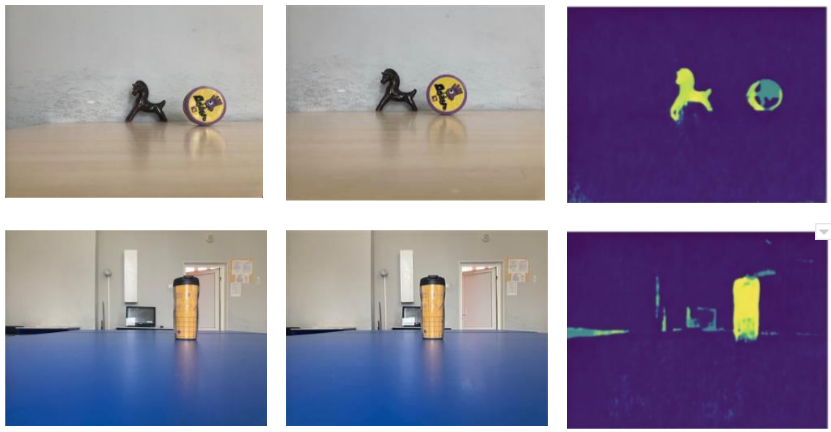

- CDN-GaNET

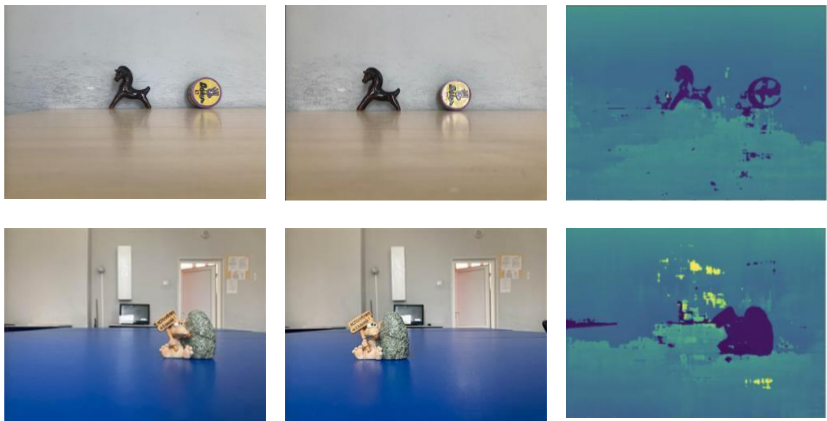

- Полученные измерения

| №   | Высота объекта  | Расстояние до объекта, Метры | Реальное расстояние до объекта, Метры | Ошибка, Миллиметры |
|-----|-----------------|------------------------------|---------------------------------------|--------------------|
| 1   | MobileStereoNet | 0.63                         | 0.6                                   | 30                 |
| 2   | MobileStereoNet | 0.64                         | 0.6                                   | 40                 |
| 3   | MobileStereoNet | 0.68                         | 0.7                                   | 20                 |
| 4   | MobileStereoNet | 0.35                         | 0.25                                  | 100                |
| 5   | CDN-GaNET       | 0.62                         | 0.6                                   | 20                 |
| 6   | CDN-GaNET       | 0.56                         | 0.6                                   | 40                 |
| 7   | CDN-GaNET       | 0.75                         | 0.7                                   | 50                 |
| 8   | CDN-GaNET       | 0.4                          | 0.25                                  | 150                |

---

2) **Расстояние между объектами**

- Пример
  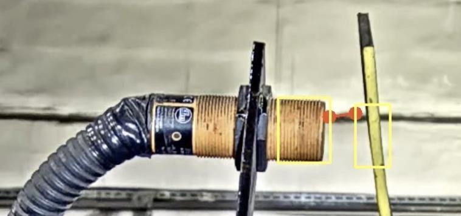

- Полученные измерения

| №   | Расстояние до объектов, Метры | Предсказанное расстояние между объектами, Миллиметры | Реальное расстояние между объекта, Миллиметры | Ошибка, Миллиметры |
|-----|-------------------------------|------------------------------------------------------|-----------------------------------------------|--------------------|
| 1   | 0.7                           | 113                                                  | 101                                           | 12                 |
| 2   | 0.7                           | 93                                                   | 101                                           | 7                  |
| 3   | 0.6                           | 105                                                  | 100                                           | 5                  |
| 4   | 0.6                           | 94                                                   | 100                                           | 6                  |
| 5   | 0.6                           | 95                                                   | 100                                           | 5                  |

---

3) **Размер объектов**

- Пример

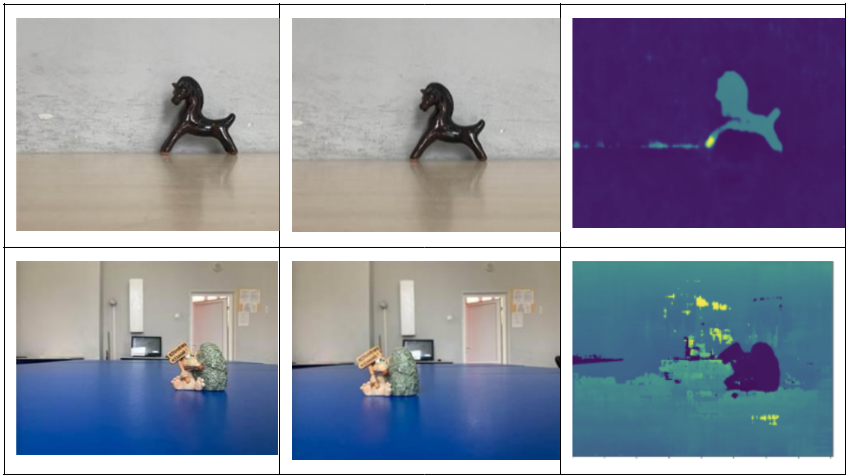

- Полученные измерения

| №   | Расстояние до объектов, Метры | Предсказанный размер объекта, Миллиметры | Реальный размер объекта, Миллиметры | Ошибка, Миллиметры |
|-----|-------------------------------|------------------------------------------|-------------------------------------|--------------------|
| 1   | 0.3                           | 153                                      | 150                                 | 3                  |
| 2   | 0.35                          | 149                                      | 150                                 | 1                  |
| 3   | 0.25                          | 148                                      | 150                                 | 2                  |
| 4   | 0.3                           | 104                                      | 100                                 | 4                  |
| 5   | 0.35                          | 102                                      | 100                                 | 2                  |
| 6   | 0.25                          | 97                                       | 100                                 | 3                  |

---

<b>Поиск дефектов и прочих образований на материале</b>

### Запуск алгоритма

  Скачать веса можно, запустив команду в терминале:
  
    wget "drive.google.com/u/3/uc?id=17X4zVFQedWeLAEgKkWcNiqPp2_j1xkgh&export=download&confirm=yes"

  Перейдя в терминале перед этим в деректорию, в которую хотите скачать веса.

  Также для алгоритма потребуются шаблоны их можно скачать в той же папке, что и веса или ввести комманду:

    

  1) Открыть директорию со скриптом

    cd examples/defects_example
    
  2) Скачать шаблоны для примера из [ссылка на веса]([[https://statanly.com/info/weight](https://drive.google.com/drive/folders/1-b0MccOAo2v6yGwBywqBCJc5MZkyUFYc)](https://drive.google.com/drive/folders/1YPBDpGG3spgh7J8HKUtmDJi7KX7BwNmJ?usp=sharing)) из папки "Дефекты на поверхностях" и распакуйте его куда угодно. Название архива "templates"
     
  4) Пример команды для запуска:  
     
   --temppath - путь к шаблоннам, которые были скачаны из предыдущего пункта.
     
    python run.py --images ../../tests/test_data/flaw_wood.jpg --weights ../../tests/test/checkpoint_ssd300.pth.tar --temppath <path_to_templates>

### Об алгоритме

    За основу алгоритма взята архитектура SSD300, в которой последний слой классификации был удален,
    а перед слоями по предсказанию сдвигов добавлен слой для для векторного представления каждой
    ограничивающей рамки и на основе функции ошибки TripletLoss создается векторное пространство, которое 
    позволяет без обучения обнаруживать дефекты на различных материалах.

Примеры детекции

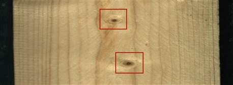
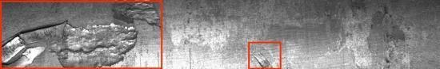

<b>Распознавание номера автомобилей</b>

### Об алгоритме

    Алгормитм по распозаванию номеров состоит из двух моделей: YOLOv8n для детекции номеров и
    CRNN для распознавания текстовых последовательностей.

  Скачать веса можно, запустив команды в терминале:
  
    wget "drive.google.com/u/3/uc?id=1BPgVR5_lZb3PO6qrdZYi9CQZaoSH8enN&export=download&confirm=yes"

    wget "drive.google.com/u/3/uc?id=1pQg7bma0qCZfgXIEPXbBrE3A8hBzHPcL&export=download&confirm=yes"
    

  Перейдя в терминале перед этим в директорию, в которую хотите скачать веса.

### Запуск алгоритма

    python3 plates_example/run.py --videofile <path_to_video> --weights <path_to_weights>

### Результаты

1) Детекция, YOLOv8n

- Пример детекции

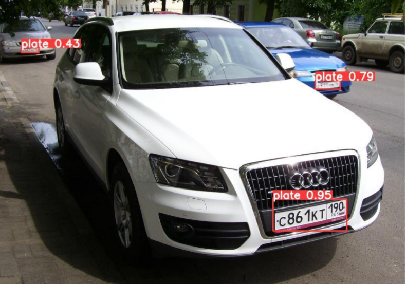

2) Распознавание, CRNN

- Пример распознавания

- Измерения (автомобили)

| Задача                | Train | Test | Valid |
|-----------------------|-------|------|-------|
| Детекция номеров      | 0.99     | 0.98    | 0.98  | 
| Цельный алгоритм  (детекция + распознавание номеров)    | 0.99     | 0.96    | 0.96  |

- Измерения (поезда)
  
| Задача                | Train | Test | Valid |
|-----------------------|-------|------|-------|
| Детекция номеров      | 0.99    | 0.93    | 0.95  | 
| Цельный алгоритм      | 0.98     | 0.89    | 0.90  |

<b>Распознавание номера вагона поезда</b>

### Об алгоритме

    Разработанный алгоритм обучен на реальных данных в различных условиях окружающей среды и предназначен 
    для обнаружения и распознавания номеров на вагонах поездов. Для алгоритма использовались архитектура из
    распознавания номеров машин.

### Результаты

- Пример детекции

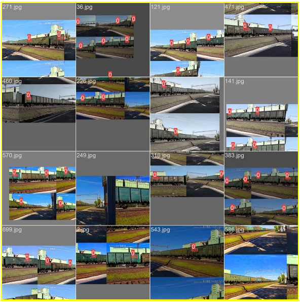

### Запуск алгоритма

<b>Распознавание QR и штрихкодов</b>

### Запуск алгоритма

  1) Открыть директорию со скриптом

    cd examples/qrcode_detection
    
  2) Пример команды для запуска:
  
    python run.py --images ../../tests/test_data/qrcodes

### Об алгоритме

    На основе OpenCV и zbar построен алгоритм по детекции QR-кодов и их расшифровке.

### Результат

Пример работы алгоритма

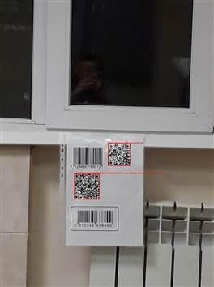

<b>Классификация транспортных средств</b>

### Запуск алгоритма
    python3 line_gui.py -v <video_file> -n <path_to_config_file>

    python3 run.py --videofile <path_to_video> -l <path_to_config_file> -w <path_to_weights>

### Об алгоритме

    Разработанный алгоритм позволяет классифицировать транспортные средства по типу кузова и, таким образом, определять
    их размеры. Это может быть необходимо при анализе поставок на заводах, фильтрации т/с, которые могут угрожать 
    безопасности персонала или при проектировке контрольно-пропускных пунктов, однако использование этого модуля не 
    ограничивается приведёнными ситуациями. Процесс работы модуля продемонстрирован на рисунке 8.1. Точность классификации 
    при IoU 0.5 составила 0,962. 

Пример определения размеров кузова

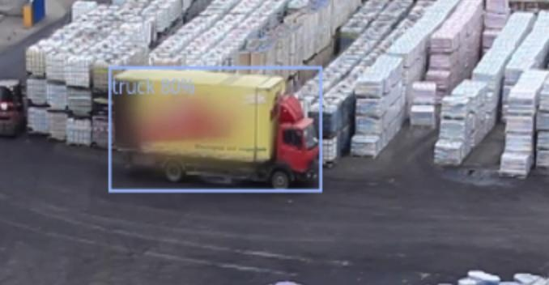

<b>Гранулометрия, распознавание размеров однородных объектов</b>

   
### Запуск алгоритма

1.Скачайте веса и подготовьте источники данных для определения размеров. Можно использовать данные из директории test_data. Поместите [веса](https://drive.google.com/drive/folders/1v1IsdUyqpYgn7ebLXpsd7Esmqb45bNMW) в директорию test_data для запуска примера.  
  Скачать веса можно, запустив команды в терминале:
  
    gdown https://drive.google.com/uc\?id\=1q5zBj6bFnR7zNQ9Rt_h3GOw6_p0MwWRs

  Перейдя в терминале перед этим в директорию, в которую хотите скачать веса.

2. Войти в директорию 
  
        cd examples/granulometry_example

3. Запустите файл примера run.py, указав в качестве параметров источники данных (параметр videofile) и строгость (параметр -c, по умолчанию 0.5).

Пример команды запуска c видео для распознавания размеров пузырей флотации: 
    
    python run.py -c 0.8 --videofile data/flotation.mp4 --weights ../checkpoints/granulometry/unet.pt

### Об алгоритме

    Гранулометрический анализ – распределение камней руды по крупности, характеризующееся процентным выходом от массы 
    или количества кусков руды. Алгоритм построен на основе архитектуры UNet, что позволяет достичь
    высокой точности в определении размеров камней на основе масок.

Пример работы алгоритма и сравнение с классическим методом водораздела

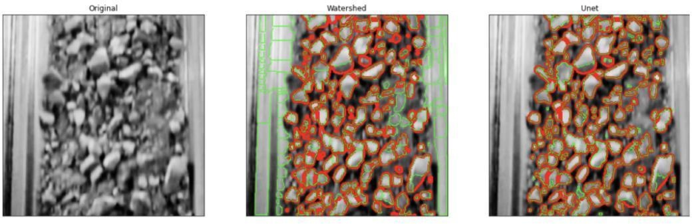

Измерения

|                |          |         | Точность | Полнота |
|----------------|----------|---------|----------|---------|
| <b>Вычисленное | <b>Камни | <b>Фон  |          |         |
| <b>Камни       | TP = 947 | FP = 56 | 94,4%    | 94,9%   |
| <b>Фон         | FN = 23  | TN = 0  |          |         |

Пример распределения камней на конвейере

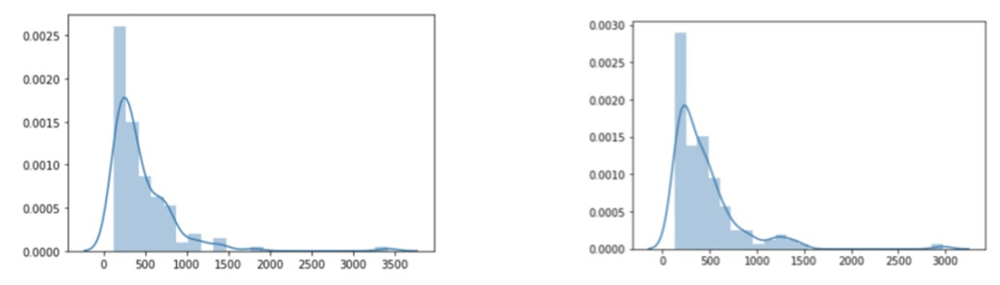

<b>Определения скорости объектов по видеопотоку</b>

### Запуск алгоритма
### Об алгоритме

    Модуль использует несколько различных алгоритмов компьютерного зрения для подсчёта скорости объекта: нейронную 
    сеть yolov5, состоящую из 367 слоёв и содержащую свыше 46 миллионов параметров, трекер объектов SORT для 
    отслеживания обнаруженных объектов и сравнения положений их центроидов, а также алгоритм расчёта скорости, 
    использующий данные о положениях центроидов, заранее известные размеры объектов (ширина или длина кузова),
    также частоту кадров, размер кадра и свободный параметр, необходимый для более точной калибровки системы. 

### Запуск алгоритма

Пример работы:

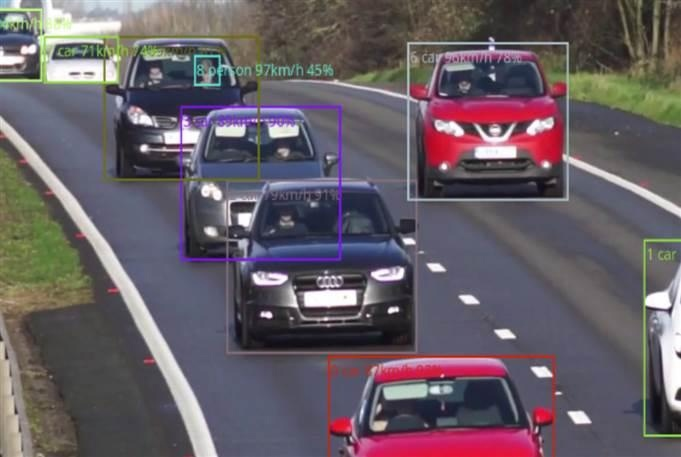

Измерения

|                                      | Измерения |
|--------------------------------------|-----------|
| <b>Средняя погрешность               | < 5 км/ч  |
| <b>Скорость работы детектора         | 0.037 c   |
| <b> Полная скорость работы алгоритма | 0.07 c    | 
Измерения проводились на RTX 3090.

## Веса

    Веса находятся по сссылке в папке в соответствие названию алгоритма: 
<b>[ссылка на веса](https://statanly.com/info/weight)
    
