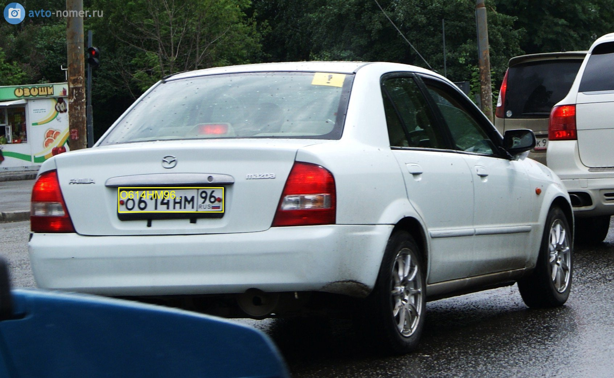
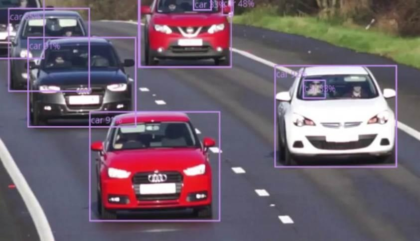

# cvflow


# Введение

CVFlow - набор алгоритмов на основе компьютерного зрения, предоставляющий,
как запуск готовых примеров, так и настройку собственных.

## Установка
0) Склонировать репозиторий

```bash
git clone https://github.com/MLFreelib/cvflow.git
```

1) Для установки всех необходимых библиотек требуется python, чтобы его установить, скачайте и
проследуйте одной из инструкций 
   1) [Oфициальный сайт python](https://www.python.org/downloads/)
   2) [Официальный сайт Anaconda](https://www.anaconda.com/download)

**Рекомендуется использовать версию python 3.8.**

2) Если в качестве установки была выбрана Anaconda, то проследуйте следующей инструкции для создания среды для работы
[Создание среды](https://docs.conda.io/projects/conda/en/latest/user-guide/tasks/manage-environments.html). Иначе, создайте виртуальную среду, используя [venv](https://docs.python.org/3/library/venv.html). 

3) После установки python/Anaconda откройте консоль и введите команду(В случае Anaconda необходимо вводить в созданной 
выше среде):
   - Для Mac OS X необходимо сначала ввести:
   
          brew install zbar
   - Для Linux необходимо сначала ввести:
   
         sudo apt-get install libzbar0
   
   - Далее для всех систем: 

         pip install -r requirements.txt

    Альтернативно зависимости можно установить через poetry:
    
        pip install poetry==1.8.2

        poetry install

4) Для использования алгоритмов на видеокарте введите команду указанную на сайте в соответствии вашим
требованиям [Официальный сайт PyTorch](https://pytorch.org/get-started/locally/)

5) Необходимо скачать [веса](https://disk.yandex.ru/d/Pg6UouWXJebn7w) и поместить их в cvflow/examples/checkpoints

## Список алгоритмов

<details open>
<summary><b>Определение положения объектов в пространстве и расстояния между ними</b></summary>

### Запуск алгоритма
  Скачайте веса модели стереозрения из директории "stereo" на [диске](https://statanly.com/info/weight) и поместите её в директорию examples/checkpoints для корректного запуска примера.
  
Запустите файл  run.py для демонстрации примера. В качестве аргументов необходимо указать путь к файлам источников данных через запятую (не менее двух). Можно использовать данные из папки stereo_tracking_example/data.

  Команда для запуска из корневой директории проекта:
```python
python -m examples.stereo_tracking_example.run --videofile examples/stereo_tracking_example/data/top_l.mov,examples/stereo_tracking_example/data/top_r.mov --weights examples/checkpoints/stereo/mobilestereonet.ckpt --config examples/stereo_tracking_example/data/conf.txt
```
### Об алгоритме

    Данный алгоритм на основе двух снимков одной сцены с разных ракурсов определяет расстояние между выделенными 
    пользователем объектами. Особенностью реализации в библиотеке является то, что алгоритм направлен на работу с 
    небольшими объектами. В библиотеке представлено несколько реализаций на основе двух моделей MobileStereoNet и 
    CDN-GaNet.

### Результаты

1) **Расстояние от камер до объектов**


- MobileStereoNet


- CDN-GaNET


- Полученные измерения

| №   | Высота объекта  | Расстояние до объекта, Метры | Реальное расстояние до объекта, Метры | Ошибка, Миллиметры |
|-----|-----------------|------------------------------|---------------------------------------|--------------------|
| 1   | MobileStereoNet | 0.63                         | 0.6                                   | 30                 |
| 2   | MobileStereoNet | 0.64                         | 0.6                                   | 40                 |
| 3   | MobileStereoNet | 0.68                         | 0.7                                   | 20                 |
| 4   | MobileStereoNet | 0.35                         | 0.25                                  | 100                |
| 5   | CDN-GaNET       | 0.62                         | 0.6                                   | 20                 |
| 6   | CDN-GaNET       | 0.56                         | 0.6                                   | 40                 |
| 7   | CDN-GaNET       | 0.75                         | 0.7                                   | 50                 |
| 8   | CDN-GaNET       | 0.4                          | 0.25                                  | 150                |

---

2) **Расстояние между объектами**

- Пример
  


- Полученные измерения

| №   | Расстояние до объектов, Метры | Предсказанное расстояние между объектами, Миллиметры | Реальное расстояние между объекта, Миллиметры | Ошибка, Миллиметры |
|-----|-------------------------------|------------------------------------------------------|-----------------------------------------------|--------------------|
| 1   | 0.7                           | 113                                                  | 101                                           | 12                 |
| 2   | 0.7                           | 93                                                   | 101                                           | 7                  |
| 3   | 0.6                           | 105                                                  | 100                                           | 5                  |
| 4   | 0.6                           | 94                                                   | 100                                           | 6                  |
| 5   | 0.6                           | 95                                                   | 100                                           | 5                  |

---

3) **Размер объектов**

- Пример


- Полученные измерения

| №   | Расстояние до объектов, Метры | Предсказанный размер объекта, Миллиметры | Реальный размер объекта, Миллиметры | Ошибка, Миллиметры |
|-----|-------------------------------|------------------------------------------|-------------------------------------|--------------------|
| 1   | 0.3                           | 153                                      | 150                                 | 3                  |
| 2   | 0.35                          | 149                                      | 150                                 | 1                  |
| 3   | 0.25                          | 148                                      | 150                                 | 2                  |
| 4   | 0.3                           | 104                                      | 100                                 | 4                  |
| 5   | 0.35                          | 102                                      | 100                                 | 2                  |
| 6   | 0.25                          | 97                                       | 100                                 | 3                  |

---


</details>

<details open>
<summary><b>Поиск дефектов и прочих образований на материале</b></summary>


### Запуск алгоритма

  Скачать веса можно по [ссылке](https://drive.google.com/drive/folders/1-b0MccOAo2v6yGwBywqBCJc5MZkyUFYc?usp=drive_link) или использовать скрипт для скачивания `download_checkpoints.sh`. Убедитесь, что путь к весам: examples/checkpoints/flaws/flaws.pt

   Выполнять код нужно из директории cvflow. Пример команды для запуска:  
     
     
    python -m examples.defects_example.run --images tests/test_data/flaws --weights examples/checkpoints/flaws/flaws.pt


### Об алгоритме

    За основу алгоритма взята архитектура Yolov8, которая была обучена на 50 тысячах изображений с дефектами. 

Примеры детекции


</details>


<details open>
<summary><b>Распознавание номера автомобилей</b></summary>

### Об алгоритме

Алгормитм по распозаванию номеров состоит из двух моделей: YOLOv8n для детекции номеров и
CRNN для распознавания текстовых последовательностей.

Убедитесь, что загружена папка с весами в папку `examples/checkpoints/plates`. Веса можно скачать по [ссылке](https://drive.google.com/drive/folders/1Y8INJvMM5FiG2FFbggo87E0ll9-lyjw5?usp=share_link) или использовать скрипт для скачивания `download_checkpoints.sh`.

### Запуск алгоритма

```python
python -m examples.plates_example.run --videofile examples/checkpoints/plates/test_video.avi --weights examples/checkpoints/plates/yolov8_plates.pt,examples/checkpoints/plates/crnn.pt
```
Note: веса передаются в формате .pt для через запятую. Первым идет файл весов для детектора – yolo.
По умолчанию используются веса из папки `examples/checkpoints/plates`.

Для запуска алгоритма на видео с поездами так же укажите два пути к весам, но используйте веса для `yolov8_plates_trains.pt` вместо `yolov8_plates.pt`.

### Результаты

1) Детекция, YOLOv8n

- Пример детекции


2) Распознавание, CRNN

- Пример распознавания



- Измерения (автомобили)

| Задача                | Train | Test | Valid |
|-----------------------|-------|------|-------|
| Детекция номеров      | 0.99     | 0.98    | 0.98  | 
| Цельный алгоритм  (детекция + распознавание номеров)    | 0.99     | 0.96    | 0.96  |

- Измерения (поезда)
  
| Задача                | Train | Test | Valid |
|-----------------------|-------|------|-------|
| Детекция номеров      | 0.99    | 0.93    | 0.95  | 
| Цельный алгоритм      | 0.98     | 0.89    | 0.90  |

</details>

<details open>
<summary><b>Распознавание номера вагона поезда</b></summary>

### Об алгоритме

    Разработанный алгоритм обучен на реальных данных в различных условиях окружающей среды и предназначен 
    для обнаружения и распознавания номеров на вагонах поездов. Для алгоритма использовались архитектура из
    распознавания номеров машин.

### Результаты

- Пример детекции


### Запуск алгоритма

</details>


<details open>
<summary><b>Распознавание QR и штрихкодов</b></summary>

### Запуск алгоритма
    
  Выполнять код нужно из директории cvflow. Пример команды для запуска:
  
    python -m examples.qrcode_detection.run --images tests/test_data/qrcodes

### Об алгоритме

    На основе OpenCV и zbar построен алгоритм по детекции QR-кодов и их расшифровке.

### Результат

Пример работы алгоритма


</details>


<details open>
<summary><b>Классификация транспортных средств</b></summary>

### Запуск алгоритма
   Скачайте [веса](https://drive.google.com/file/d/1A5vtooMwaz2TPBdQQWuDnV7qIg5oC8bA/view?usp=drive_link)
 
    python -m examples.objects_counter_example.line_gui -v "examples/checkpoints/plates/test_video.avi" -n conf

    python -m examples.objects_counter_example.run --videofile "examples/checkpoints/plates/test_video.avi" -l "examples/checkpoints/objects_counter and speed_detection/conf" -w "examples/checkpoints/objects_counter and speed_detection/yolo_for_opencv.pt"


### Об алгоритме

    Разработанный алгоритм позволяет классифицировать транспортные средства по типу кузова и, таким образом, определять
    их размеры. Это может быть необходимо при анализе поставок на заводах, фильтрации т/с, которые могут угрожать 
    безопасности персонала или при проектировке контрольно-пропускных пунктов, однако использование этого модуля не 
    ограничивается приведёнными ситуациями. Процесс работы модуля продемонстрирован на рисунке 8.1. Точность классификации 
    при IoU 0.5 составила 0,962. 

Пример определения размеров кузова




</details>


<details open>
<summary><b>Гранулометрия, распознавание размеров однородных объектов</b></summary>
   
### Запуск алгоритма

1.Скачайте веса и подготовьте источники данных для определения размеров. Можно использовать данные из директории test_data. Поместите [веса](https://drive.google.com/drive/folders/1v1IsdUyqpYgn7ebLXpsd7Esmqb45bNMW) в директорию examples/checkpoints для запуска примера.  


3. Запустите файл примера run.py, указав в качестве параметров источники данных (параметр videofile) и строгость (параметр -c, по умолчанию 0.5).

Пример команды запуска c видео для распознавания размеров пузырей флотации: 
    
     python -m examples.granulometry_example.run -c 0.8 --videofile examples/granulometry_example/data/flotation.mp4 --weights examples/checkpoints/granulometry/unet.pt


### Об алгоритме

    Гранулометрический анализ – распределение камней руды по крупности, характеризующееся процентным выходом от массы 
    или количества кусков руды. Алгоритм построен на основе архитектуры UNet, что позволяет достичь
    высокой точности в определении размеров камней на основе масок.

Пример работы алгоритма и сравнение с классическим методом водораздела


Измерения


|                |          |         | Точность | Полнота |
|----------------|----------|---------|----------|---------|
| <b>Вычисленное | <b>Камни | <b>Фон  |          |         |
| <b>Камни       | TP = 947 | FP = 56 | 94,4%    | 94,9%   |
| <b>Фон         | FN = 23  | TN = 0  |          |         |


Пример распределения камней на конвейере


</details>

<details open>
<summary><b>Определения скорости объектов по видеопотоку</b></summary>

### Запуск алгоритма
Скачайте веса: [веса для speed_detection](https://drive.google.com/file/d/1A5vtooMwaz2TPBdQQWuDnV7qIg5oC8bA/view?usp=drive_link)
```
python -m examples.speed_detection_example.run --videofile "examples/checkpoints/objects_counter and speed_detection/cvflow_test.mp4" -w "examples/checkpoints/objects_counter and speed_detection/yolo_for_opencv.pt"
```

### Об алгоритме

    Модуль использует несколько различных алгоритмов компьютерного зрения для подсчёта скорости объекта: нейронную 
    сеть yolov5, состоящую из 367 слоёв и содержащую свыше 46 миллионов параметров, трекер объектов KCF для 
    отслеживания обнаруженных объектов и сравнения положений их центроидов, а также алгоритм расчёта скорости, 
    использующий данные о положениях центроидов, заранее известные размеры объектов (ширина или длина кузова),
    также частоту кадров, размер кадра и свободный параметр, необходимый для более точной калибровки системы. 

Пример работы:


Измерения


|                                      | Измерения |
|--------------------------------------|-----------|
| <b>Средняя погрешность               | < 15 км/ч  |
| <b>Скорость работы детектора         | 0.037 c   |
| <b> Полная скорость работы алгоритма | 0.07 c    | 
Измерения проводились на RTX 3090.

</details>

## Минимальные требования к а библиотеки

ЦПУ: Intel Core i5-9400F и выше.

ОЗУ: 8 ГБ и выше.

Видеокарта: NVIDIA GeForce GTX 1660 и выше.

Рекомендуемая версия Python: 3.8.

## Веса

    Веса находятся по сссылке в папке в соответствие названию алгоритма: 
<b>[ссылка на веса](https://statanly.com/info/weight)
    
